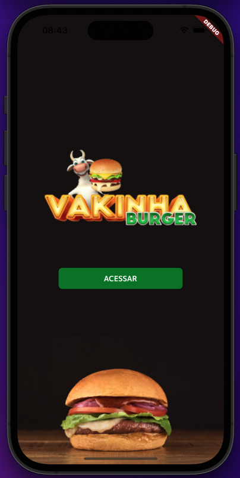
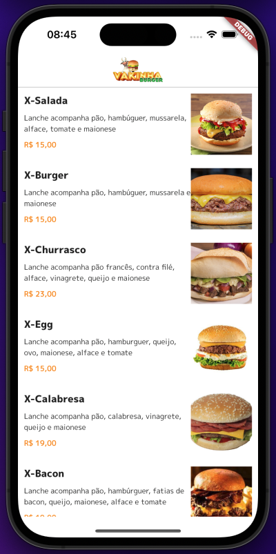
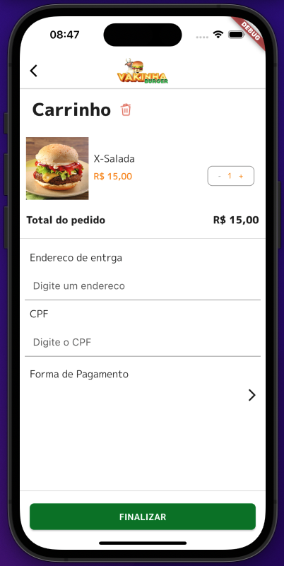

# Aplicativo de Delivery 🍔 🍟 

Este é um aplicativo de delivery desenvolvido em Flutter, utilizando Provider e Bloc/Cubit. O aplicativo permite que os usuários visualizem produtos, façam pedidos, gerenciem o carrinho de compras e escolha a forma o pagamento.

## Estrutura do Projeto 🏗️

O projeto está estruturado da seguinte forma:

- **core**: Contém funções e classes essenciais para o funcionamento da aplicação.
- **dtos**: Classes que representam objetos de transferência de dados (DTOs) utilizados entre as features.
- **models**: Modelos de dados que representam entidades dentro do aplicativo.
- **pages**: Contém as diferentes features do aplicativo, organizadas por funcionalidade.
- **repositories**: Repositórios responsáveis pela comunicação externa.

## Features 🚀

A seguir estão exemplos de algumas das principais features implementadas no aplicativo:

### Listagem de Produtos

- Os usuários podem visualizar uma lista de produtos disponíveis para compra.
- Os produtos são exibidos em uma interface amigável com imagem, nome, descrição e preço.

### Informações do Produto

- Os usuários podem acessar detalhes de um produto específico para adicionar a quantia desejada ao carrinho.

### Cadastro de Cliente

- Os usuários podem criar uma conta fornecendo as informações necessárias, como nome, endereço, e-mail e telefone.
- O cadastro é armazenado localmente ou enviado para um servidor, dependendo da implementação.

### Login com Validação de Token

- Os usuários podem fazer login usando suas credenciais previamente cadastradas.
- O aplicativo valida o token de autenticação recebido do servidor para garantir a autenticidade e a segurança.

### Carrinho de Compras

- Os usuários podem adicionar produtos ao carrinho de compras.
- O carrinho de compras exibe a lista de produtos selecionados, quantidades, preços e o total a pagar.

### Efetuar Pedido

- O usuário pode revisar os itens no carrinho de compras e efetuar o pedido final.
- O usuário deve informar local de entrega e forma de pagamento.

## Executando o Projeto ▶️

Certifique-se de ter o Flutter SDK instalado em seu ambiente de desenvolvimento. Em seguida, siga as etapas abaixo:

1. Clone o repositório do aplicativo de delivery.
2. Abra o terminal e navegue até o diretório raiz do projeto.
3. Crie um arquivo **.env** e em seguida atribua o valor correto para **backend_base_url**.
3. Execute o comando `flutter pub get` para obter as dependências necessárias.
4. Conecte um dispositivo ou inicie um emulador.
5. Execute o comando `flutter run` para iniciar o aplicativo.

Certifique-se de que o dispositivo/emulador esteja configurado corretamente e esteja rodando uma versão compatível do Flutter.

 
 

---
 
 

# Delivery App 🍔 🍟

This is a delivery app developed in Flutter, using Provider and Bloc/Cubit. The app allows users to view products, place orders, manage the shopping cart, and choose the payment method.

## Project Structure 🏗️

The project is structured as follows:

- **core**: Contains essential functions and classes for the application to work.
- **dtos**: Data Transfer Object (DTO) classes used between features.
- **models**: Data models representing entities within the app.
- **pages**: Contains different features of the app, organized by functionality.
- **repositories**: Repositories responsible for external communication.

## Features 🚀

Below are examples of some of the main features implemented in the app:

### Product Listing

- Users can view a list of products available for purchase.
- Products are displayed in a user-friendly interface with image, name, description, and price.

### Product Details

- Users can access details of a specific product to add the desired quantity to the cart.

### Customer Registration

- Users can create an account by providing necessary information such as name, address, email, and phone number.
- The registration is stored locally or sent to a server, depending on the implementation.

### Token-based Login

- Users can log in using their previously registered credentials.
- The app validates the authentication token received from the server to ensure authenticity and security.

### Shopping Cart

- Users can add products to the shopping cart.
- The shopping cart displays the list of selected products, quantities, prices, and the total amount to pay.

### Place Order

- The user can review the items in the shopping cart and place the final order.
- The user needs to provide delivery location and payment method.

## Running the Project ▶️

Make sure you have the Flutter SDK installed in your development environment. Then, follow the steps below:

1. Clone the delivery app repository.
2. Open the terminal and navigate to the root directory of the project.
3. Create a **.env** file and assign the correct value to **backend_base_url**.
4. Run the command `flutter pub get` to get the necessary dependencies.
5. Connect a device or start an emulator.
6. Run the command `flutter run` to start the app.

Make sure the device/emulator is properly configured and running a compatible version of Flutter.

## Screenshots 📱

- splash screen  

- list products screen  

- product detail screen  

- login screen  

- order detail screen  
